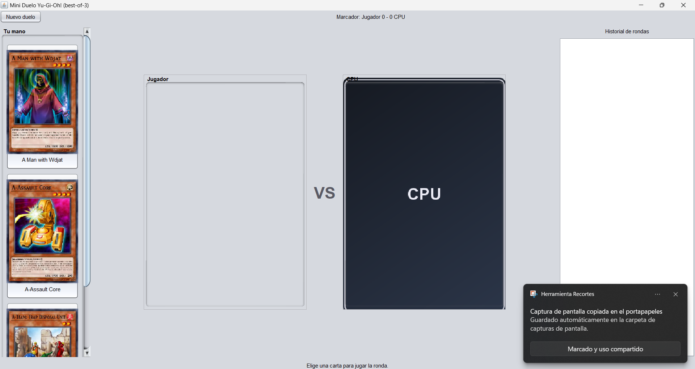
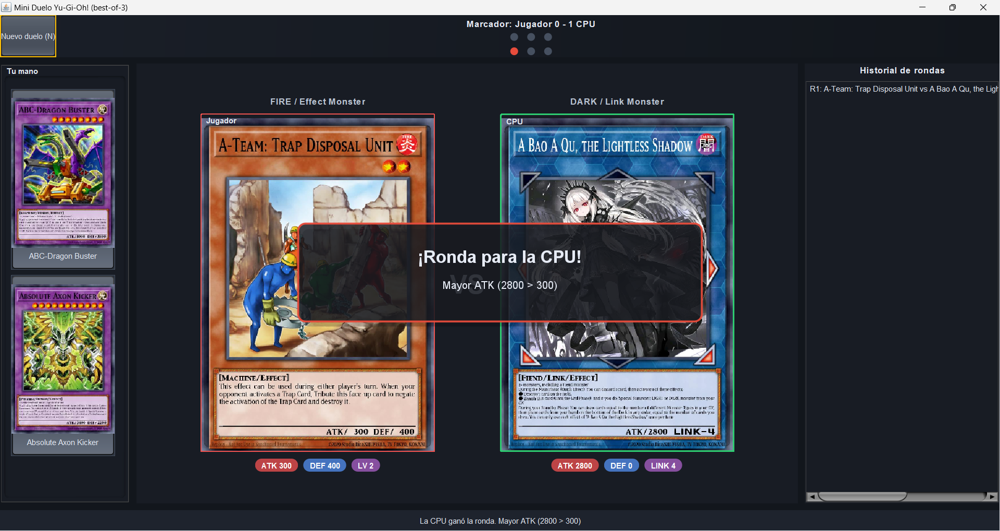
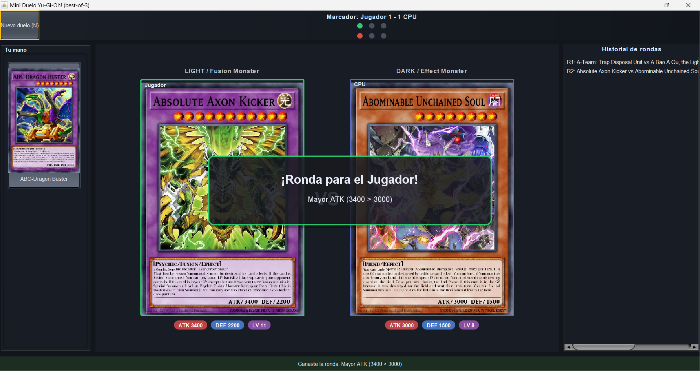
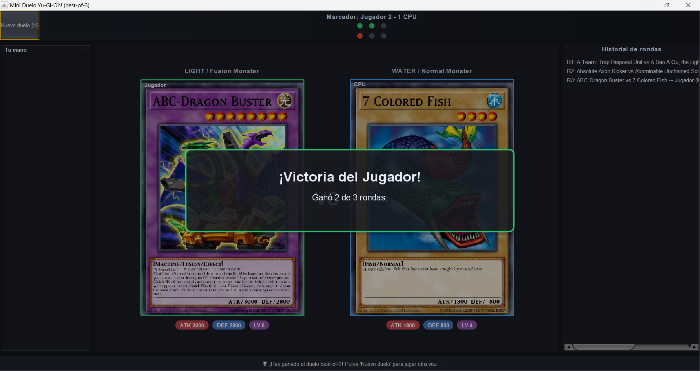

# Mini Duelo Yu-Gi-Oh! (Java Swing + YGOPRODeck API)

Aplicación de escritorio que simula un duelo **best-of-3** entre **Jugador** y **CPU** usando datos en vivo de la API pública de **YGOPRODeck**.  
Cada participante recibe 3 **cartas Monster** aleatorias (con imagen y atributos). En cada ronda eliges una carta; la CPU elige la suya al azar. Se muestran animaciones, se calcula el ganador y el primero en ganar **2 de 3** vence el combate.

> **Datos e imágenes**: [YGOPRODeck API](https://ygoprodeck.com/api-guide/) — respeta su rate-limit.

---

## ✨ Características

- UI estable (tamaños fijos): **mano** izquierda, **arena** central, **historial** derecha.
- **Chips** de estadísticas bajo cada carta (ATK / DEF / LV o LINK).
- **Metadatos** visibles (ATTRIBUTE / TYPE) encima de cada carta.
- **Banners** de ronda y de victoria del combate (overlay con fade).
- **Pips** de progreso del match (⬤⬤⬤) para Jugador y CPU.
- **Hotkeys**: `1/2/3` para jugar carta; `N` para **Nuevo duelo**.
- Carga de imágenes en **background** + **caché local**.

---

## 🚀 Cómo ejecutar

### Requisitos
- **Java 17** (o superior)
- **Maven 3.8+**
- Conexión a Internet

### IDE
1. Clona el repo e **importa como proyecto Maven**.
2. Ejecuta la clase `org.LeetCode.ui.App` (método `main`).
3. ¡Listo! Se abrirá la ventana.


---

## 🎮 Cómo jugar

1. **Reparto:** al iniciar o pulsar **Nuevo duelo (N)**, se reparten 3 Monsters al Jugador y 3 a la CPU.
2. **Tu turno:** elige una carta (clic o `1/2/3`).
3. **CPU:** selecciona su carta al azar; se revela con un breve **delay**.
4. **Resolución:** aparece un **banner** con el ganador de la ronda y el **motivo**.
5. **Marcador:** se actualizan el **score** y los **pips** de progreso.
6. **Victoria:** quien gana **2 rondas** se lleva el combate. Usa **Nuevo duelo (N)** para reiniciar.

### Controles
| Acción                 | Atajo |
|-----------------------|:-----:|
| Jugar carta #1        |  `1`  |
| Jugar carta #2        |  `2`  |
| Jugar carta #3        |  `3`  |
| Nuevo duelo / Reparto |  `N`  |

---

## 🧠 Reglas de comparación (simplificadas)

1. **ATK** más alto gana.
2. Empate en ATK → gana **DEF** más alto.
3. Si aún empatan → gana **LV** (o **LINK** si aplica).
4. Persistiendo el empate → **aleatorio**.

> En la UI verás el **motivo** (p. ej., “ATK superior”).

---

## 🖥️ Guía rápida de la interfaz

- **Mano (izquierda):** 3 miniaturas con nombre (tooltip con stats).
- **Arena (centro):**
    - Arriba: **ATTRIBUTE / TYPE** de cada carta.
    - Centro: imágenes grandes con un **VS** con efecto neón.
    - Abajo: **chips** con ATK/DEF/LV/LINK.
- **Historial (derecha):** lista de rondas con resultado y motivo.
- **Barra superior:** **marcador** y **pips** del match.
- **Barra inferior:** **estado** contextual (verde/rojo breve).

---

## 🧱 Diseño (breve)

Separación por capas: **api** (cliente `HttpClient` hacia YGOPRODeck y mapeo JSON), **model** (POJOs de carta), **game** (lógica del duelo best-of-3, jugadores y resultados), **util** (caché de imágenes y helpers) y **ui** (Swing con `SwingWorker` para no bloquear el EDT).  
La UI usa tamaños fijos para mantener un layout estable y animaciones ligeras (overlays y glow) para claridad y *game-feel*.

Se prioriza una experiencia fluida: llamada **batch** a la API para traer lotes y filtrar localmente, **caché** en disco para imágenes, y trabajo en **background** para red/escala. La comparación se mantiene simple para favorecer el aprendizaje y el rendimiento.

---

## 🛠️ Notas técnicas

- **Fuente de datos:** por defecto `cardinfo.php` (lotes + filtro local). Si necesitas obligar `randomcard.php`, ajusta el reparto en `DuelFrame.startNewDuel()`.
- **Caché de imágenes:** carpeta local (p. ej. `~/.ygo-cache`) para acelerar ejecuciones posteriores.
- **Hilos:** red y escalado de imágenes corren con `SwingWorker` (UI no bloqueada).

---

## 🧩 Estructura de paquetes

```
api/      -> Cliente HTTP YGOPRODeck + parseo JSON
game/     -> Lógica del duelo (Duel, Player, RoundResult, Winner, comparador)
model/    -> POJOs (Card, CardImage, CardPrice…)
ui/       -> Swing (DuelFrame, App, Theme, ChipLabel, StatsPanel, overlays)
util/     -> Cache de imágenes y utilidades
```

---

## 🧯 Solución de problemas

- **“No se pudieron obtener cartas”** → revisa Internet/firewall; reintenta **Nuevo duelo (N)**.
- **Imágenes lentas o vacías** → primera ejecución cachea; espera y reintenta.
- **Java no encontrado** → instala **Java 17+** y verifica `java -version`.
- **UI muy grande/pequeña** → ajusta el escalado del sistema operativo.

---

## 📸 Capturas







---

## 📄 Licencia y créditos

Proyecto con fines educativos. Las imágenes y marcas pertenecen a sus respectivos dueños (YGOPRODeck / Konami).  
Consulta los términos de uso de **YGOPRODeck API** antes de redistribuir.
