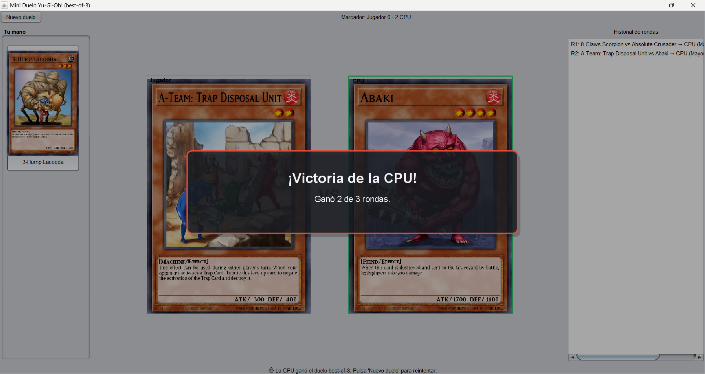

# Mini Duelo Yu-Gi-Oh! (Java Swing + YGOPRODeck API)

Aplicación de escritorio que simula un duelo sencillo (best-of-3) entre el jugador y la CPU usando datos **en vivo** de la API pública de **YGOPRODeck**. Cada participante recibe 3 cartas **Monster** aleatorias (con imagen y atributos), el jugador elige su carta por ronda y la CPU selecciona al azar. La carta ganadora se decide por **ATK → DEF → Level/Link → aleatorio**. Primeros en ganar **2 de 3** rondas, gana el combate.

> Créditos de datos e imágenes: [YGOPRODeck API](https://ygoprodeck.com/api-guide/). Respeta su rate-limit y evita hotlinking abusivo.

---

## 🚀 Instrucciones de ejecución

### Requisitos
- **Java 17** (o superior).
- **Maven 3.8+** (o usa tu IDE).
- Conexión a Internet (la app consulta la API y descarga imágenes la primera vez).

### Ejecutar desde tu IDE
1. Importa el proyecto como **Maven Project**.
2. Ejecuta la clase: `org.LeetCode.ui.App` (método `main`).
3. ¡Listo! Se abrirá la ventana Swing.

### Imagenes

